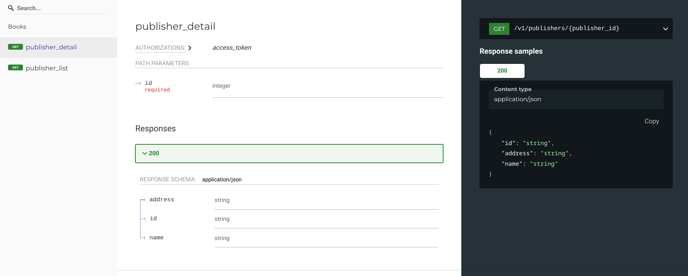
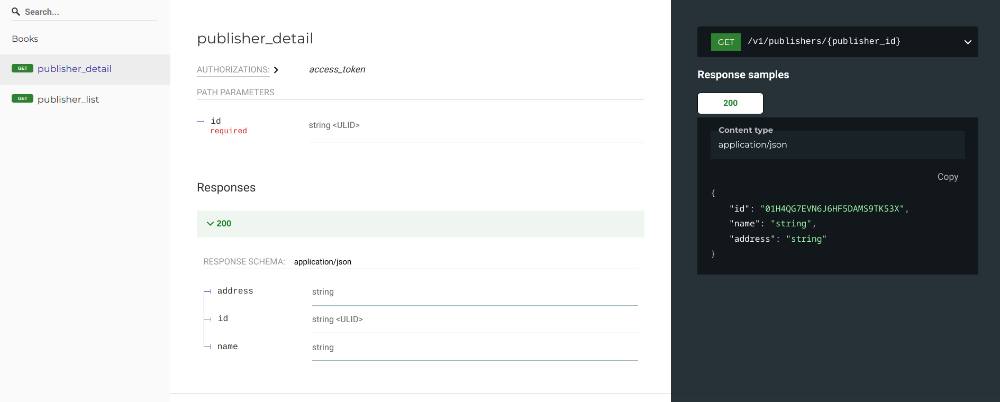

# Documenting custom marshmallow field types

`flask-marshmallow-openapi` relies heavily on
[apispec](https://apispec.readthedocs.io/en/latest/) to generate type documentation.
`apispec` itself works well with all `marshmallow.Field` types and has documentation how
to add new ones.

Since `flask-marshmallow-openapi` strongly encapsulates `apispec`, instead of exposing
it to end users, `OpenAPI` middleware implements wrappers for internal `apispec`
functionality. This is best explained by example.

Lets assume we want to introduce filed type representing
[ULID](https://github.com/ulid/spec).

First, we need to create `marshmallow.Field` class:

```py
class UlidField(fields.String):
    OPENAPI_SCHEMA_ATTRS = {
        "type": "string",
        "format": "ULID",
        "examples": [
            "01H4QG7EVN6J6HF5DAMS9TK53X",
            "01H4QG7F1XB3MGW7GHB5PA4P89",
            "01H4QG7F864HBXG63N8PBF1XBM",
            "01H4QG7FEEW0D463QJEREF81P3",
            "01H4QG7FMQCE8DAPV6EQZREDX4",
            "01H4QG7FTZYHYM92AG6TG5ZDFR",
            "01H4QG7G1898PRWKBAED26J0VE",
            "01H4QG7G7H3DWQ671CV4PF6D62",
            "01H4QG7GDSYJ0ZWF8J39XRAMR0",
            "01H4QG7GM2WWEYQPAGM57MYK4Y",
            "01H4QG7VE3BY903B5DNJ442RDN",
            "01H4QG7WDCAWS1DN52EWWYXTG9",
            "01H4QG7XCPGCPB3BYN0QPFX61R",
            "01H4QG7XCPGCPB3BYN0QPFX61S",
            "01H4QG7ZB859YDH4GXWY9V8V1H",
            "01H4QG80AHN36H1X1R2FEG61V4",
            "01H4QG819VCQFN67QXQCMRYD85",
            "01H4QG8294DFA2S9CZTBGEPCNE",
            "01H4QG838EMDFGRHN9AZW3SJGG",
            "01H4QG847Q1KVSQE6F8GXKRTJH",
        ],
    }

    OPENAPI_URL_ID_PARAMETER = {
        "name": "id",
        "in": "path",
        "required": True,
        "allowEmptyValue": False,
        "schema": {k: v for k, v in OPENAPI_SCHEMA_ATTRS.items() if k != "examples"},
    }


    def __init__(self, **kwargs):
        super().__init__(**kwargs)
        self.metadata["format"] = self.OPENAPI_SCHEMA_ATTRS["format"]
        self.validators.insert(0, ulid_validator)


RE_ULID = re.compile(r"[0-9A-HJKMNP-TV-Z]{26}")


def ulid_validator(value):
    if not RE_ULID.match(value):
        raise ValidationError("must be ULID encoded as Crockford's base32 string!")
```

Then, let's add some schemas using it:

```py
class PublisherSchema(ma.Schema):
    id = UlidField()
    name = ma.fields.String()
    address = ma.fields.String()


@open_api.get_list(response_schema=PublisherSchema)
@api.route("/publishers", methods=["GET"])
def publishers_list():
    ...


@open_api.get_detail(response_schema=PublisherSchema)
@api.route("/publishers/<publisher_id>", methods=["GET"])
def publishers_details(publisher_id):
    ...
```

Problem is, this is still not showing correct type in docs:



We need to do some more work for that to happen:

- override URL parameter ID definition (like in "Documenting URL parameters")
- override generated type documentation for our new field

First, let's override URL parameter:

```py
class SchemaOpts(ma.SchemaOpts):
    def __init__(self, meta, *args, **kwargs):
        self.url_parameters: list[ParameterObject | dict] | None = getattr(
            meta, "url_parameters", None
        )
        super().__init__(meta, *args, **kwargs)


class PublisherSchema(ma.Schema):
    OPTIONS_CLASS = SchemaOpts

    class Meta:
        url_parameters = [
            {
                "name": "id",
                "in": "path",
                "required": True,
                "allowEmptyValue": False,
                "schema": {
                    k: v
                    for k, v in UlidField.OPENAPI_SCHEMA_ATTRS.items()
                    # Not strictly necessary, but reduces spam in docs
                    if k != "examples"
                },
            }
        ]

    id = UlidField()
    name = ma.fields.String()
    address = ma.fields.String()
```

Finally, we need to inform OpenAPI middleware of our new type:

```py
conf = OpenAPISettings(
    api_version="v1", api_name="My API", app_package_name="my_api", mounted_at="/v1"
)
docs = OpenAPI(config=conf)


def Ulid_field2properties(self, field, **kwargs):
    if isinstance(field, UlidField):
        return UlidField.OPENAPI_SCHEMA_ATTRS.items()
    return dict()
docs.add_attribute_function(ULID_field2properties)

docs.init_app(app)
```

```{important}
All calls to `OpenAPI.add_attribute_function()` must happen before `OpenAPI.init_app`.

Obviously, if OpenAPI is initialized like `docs = OpenAPI(config, app)` then it is
already to late to call `OpenAPI.add_attribute_function()`.
```

More details on why and how this works are in [apispec custom fields
documentation](https://apispec.readthedocs.io/en/latest/using_plugins.html#custom-fields)

This finally gives us correct type and correct example values in generated docs:


