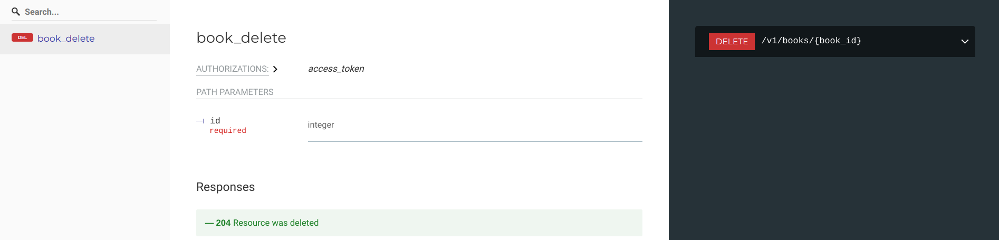

# Documenting DELETE routes

Delete routes don't have request body but we still need to provide our schema to
`@delete` decorator so it can generate docs. Remember, `flask-marshmallow-openapi` is
using your schemas to figure out a lot of information about your API.

Example:

```py
# Using Flask app from "Getting started", this is fully working example
@api.route("/books/<int:book_id>", methods=["DELETE"])
@open_api.delete(BookSchema)
def books_delete(book_id):
    return flask.jsonify({})
```

`@delete` decorator assumes using of positional integer object identifier named `id`
just like `@get_detail` and `@patch`. Using different names for positional parameters,
different types and documenting named URL params is all supported and is demonstrated
later in the docs.

Above code will get us:


