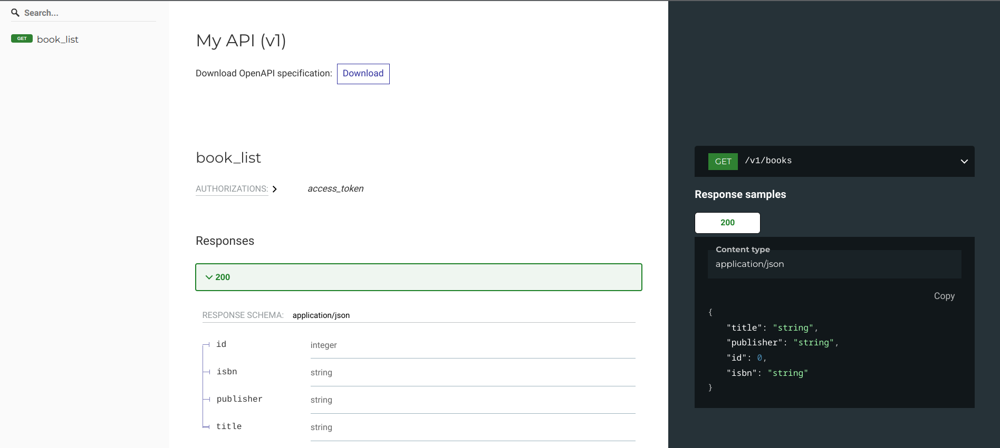
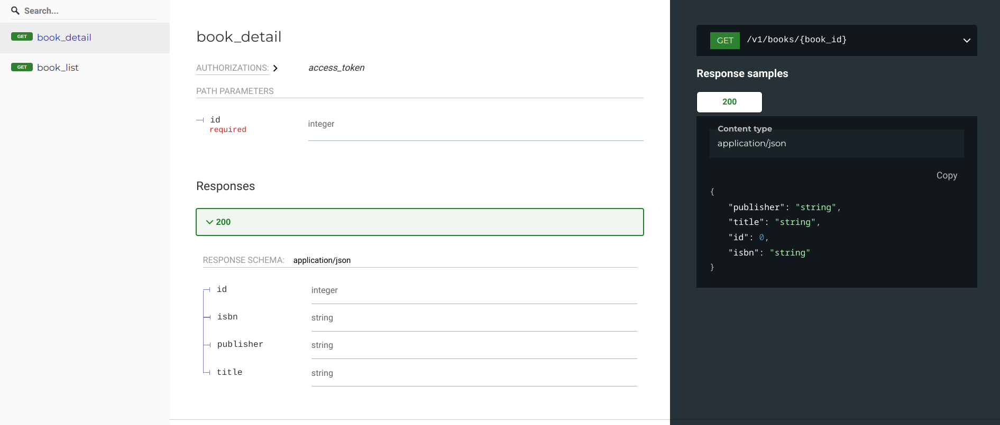
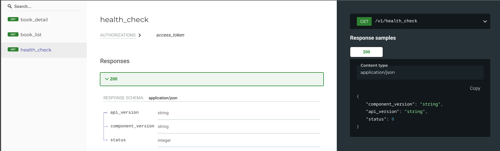

# Documenting GET routes

`GET` routes usually return either a list of objects or details of one object.

## GET a list of objects

```py
# Using Flask app from "Getting started", this is fully working example
@open_api.get_list(response_schema=BookSchema)
@api.route("/books", methods=["GET"])
def books_list():
    return flask.jsonify(
        BookSchema(many=True).dump(
            [
                {"id": 24, "title": "title", "publisher": "publisher", "isbn": "isbn"},
                {"id": 42, "title": "title", "publisher": "publisher", "isbn": "isbn"},
            ]
        )
    )
```



## GET details of an object

```py
# Using Flask app from "Getting started", this is fully working example
@open_api.get_detail(response_schema=BookSchema)
@api.route("/books/<int:book_id>", methods=["GET"])
def books_details(book_id):
    return flask.jsonify(
        BookSchema(many=False).dump(
            {"id": 42, "title": "title", "publisher": "publisher", "isbn": "isbn"}
        )
    )
```



`@get_detail` decorator assumes using of positional integer object identifier named
`id`.

Since this parameter is positional (part of URL path `/books/42` and not one of named
URL params like `/books?book_id=42`) it's name doesn't matter from perspective of API
consumer.

Using different names for positional parameters, different types and documenting named
URL params is all supported and is demonstrated later in the docs.

## GET routes returning single object without ID parameter

We can use generic `@get` decorator with `is_list` and `has_id_in_path` to accomplish
this:

```py
# Using Flask app from "Getting started", this is fully working example
class ApiHealthCheckSchema(ma.Schema):
    api_version = ma.fields.String(allow_none=False)
    component_version = ma.fields.String(allow_none=False)
    status = ma.fields.Integer(as_string=True)


@api.route("/health_check", methods=["GET"])
@open_api.get(
    response_schema=ApiHealthCheckSchema,
    operation_id="health_check",
    is_list=False,
    has_id_in_path=False,
)
def health_check():
    return ApiHealthCheckSchema(many=False).dump(
        {"api_version": "v1", "component_version": "1.2.3", "status": 42}
    )
```


