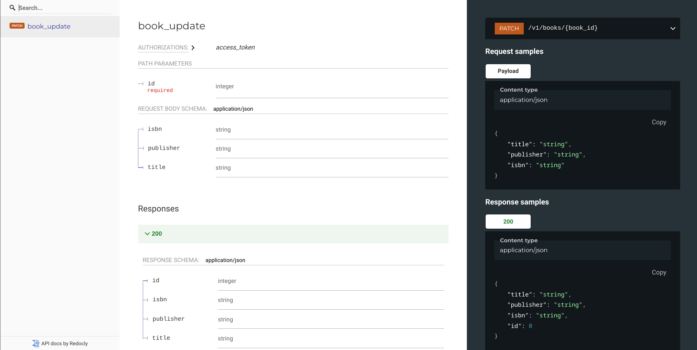
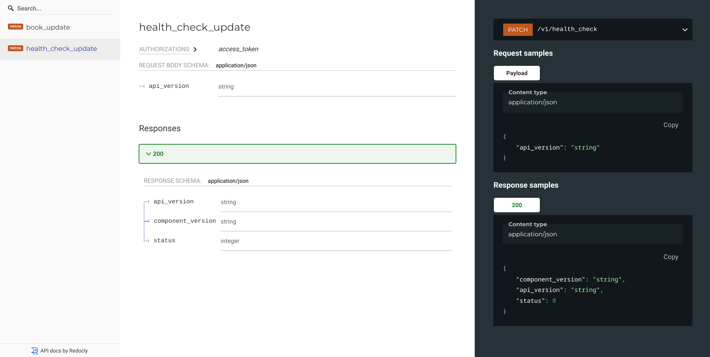

# Documenting PATCH routes

Similar to `POST`, `PATCH`-ing objects might also require different validation rules
than the ones defined by base schema class. This means that `@patch` decorator would
also benefit from having different schemas for request and response bodies (just like
`@post`).

For example, let's assume that we don't want to allow update of `book.id`:


```py
# Using Flask app from "Getting started", this is fully working example
class BookUpdateSchema(ma.Schema):
    id = ma.fields.Integer(as_string=True, dump_only=True)
    title = ma.fields.String(allow_none=False)
    publisher = ma.fields.String(allow_none=False)
    isbn = ma.fields.String(allow_none=False)


@api.route("/books", methods=["PATCH"])
@open_api.patch(request_schema=BookUpdateSchema, response_schema=BookSchema)
def books_update():
    data = BookUpdateSchema(many=False).load(flask.request.json)
    # Update object from data...
    return flask.jsonify(
        BookSchema(many=False).dump(
            {"id": 42, "title": "title", "publisher": "publisher", "isbn": "isbn"}
        )
    )
```

`@patch` decorator assumes using of positional integer object identifier named `id` just
like `@get_detail`. Using different names for positional parameters, different types and
documenting named URL params is all supported and is demonstrated later in the docs.

Above code will get us:




## PATCH routes without ID

These should be rare in decent behaving API-s, but we still might need them sometimes.
Simply use `has_id_in_path=False` parameter for `@patch` decorator:

```py
# Using Flask app from "Getting started", this is fully working example
class ApiHealthCheckUpdateSchema(ma.Schema):
    api_version = ma.fields.String(allow_none=False)
    component_version = ma.fields.String(allow_none=False, dump_only=True)
    status = ma.fields.Integer(as_string=True, dump_only=True)


@api.route("/health_check", methods=["PATCH"])
@open_api.patch(
    request_schema=ApiHealthCheckUpdateSchema,
    response_schema=ApiHealthCheckSchema,
    operation_id="health_check_update",
    has_id_in_path=False,
)
def health_check_update():
    data = ApiHealthCheckUpdateSchema(many=False).load(flask.request.json)
    # Update object from data...
    return ApiHealthCheckSchema(many=False).dump(
        {"api_version": "v1", "component_version": "1.2.3", "status": 42}
    )
```


