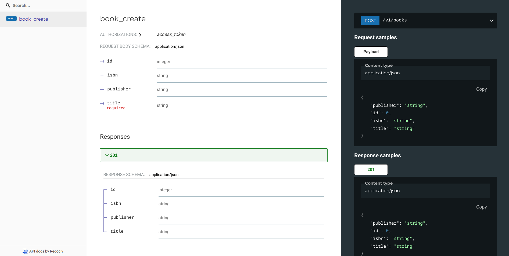

# Documenting POST routes

When doing `POST`, some attributes of our objects may be `required`. In general case we
may need to use different validation rules than the ones defined by base schema class.
For that reason, it makes sense to allow different schemas for `POST` request and
response.

For example, let's assume we want to make `book.title` a required `POST` attribute:

```py
# Using Flask app from "Getting started", this is fully working example
class BookCreateSchema(ma.Schema):
    id = ma.fields.Integer(as_string=True)
    title = ma.fields.String(allow_none=False, required=True)
    publisher = ma.fields.String(allow_none=False)
    isbn = ma.fields.String(allow_none=False)


@api.route("/books", methods=["POST"])
@open_api.post(request_schema=BookCreateSchema, response_schema=BookSchema)
def books_create():
    data = BookCreateSchema(many=False).load(flask.request.json)
    # Create object from data...
    return flask.jsonify(
        BookSchema(many=False).dump(
            {"id": 42, "title": "title", "publisher": "publisher", "isbn": "isbn"}
        )
    )
```

Above code will get us:


