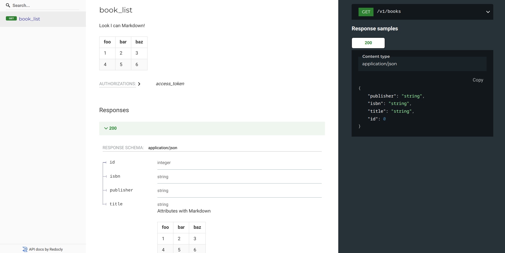

# Markdown and docstrings

`flask-marshmallow-openapi` parses route docstrings. If those docstrings are correctly
formatted, merges them into generated OpenAPI documentation.

"correctly formatted" means these docstrings are either a simple block of text or a
valid OpenAPI `yaml`.

Simple blocks of text are always interpreted as OpenAPI `description` attribute. `yaml`
on the other hand can contain any kind of OpenAPI data that will be happily merged into
final OpenAPI object and exported into `swagger.json`.

This means you can write any kind of OpenAPI docs in there. Although this is highly
inconvenient - it is easier to rely on `flask-marshmallow-openapi` to do that hard work
instead - it allows for covering any scenario that `flask-marshmallow-openapi` don't.
We won't concentrate on this highly advanced use case here, but instead demonstrate
other one: object descriptions.

In case of object descriptions, Python docstrings are ideal for writing long paragraphs
of text. If your OpenAPI viewer supports Markdown, then these descriptions can really
enrich any API docs. Bundled viewers (`ReDoc` and `SwaggerUI`) support Markdown.

For example, we can add Markdown description to `GET /book/` and to some `BookSchema`
attributes:

```py
# Using Flask app from "Getting started", this is fully working example
import textwrap

class BookSchema(ma.Schema):
    id = ma.fields.Integer(as_string=True)
    title = ma.fields.String(
        allow_none=False,
        metadata={
            "description": textwrap.dedent(
                """
                Attributes with Markdown

                | foo | bar | baz |
                | --- | --- | --- |
                | 1   | 2   | 3   |
                | 4   | 5   | 6   |
                """
            )
        },
    )
    publisher = ma.fields.String(allow_none=False)
    isbn = ma.fields.String(allow_none=False)


@open_api.get_list(response_schema=BookSchema)
@api.route("/books", methods=["GET"])
def books_list():
    """
    description: |
        Look I can Markdown!

        | foo | bar | baz |
        | --- | --- | --- |
        | 1   | 2   | 3   |
        | 4   | 5   | 6   |
    """
    return flask.jsonify(
        BookSchema(many=True).dump(
            [
                {"id": 24, "title": "title", "publisher": "publisher", "isbn": "isbn"},
                {"id": 42, "title": "title", "publisher": "publisher", "isbn": "isbn"},
            ]
        )
    )
```

Above code will get us:


