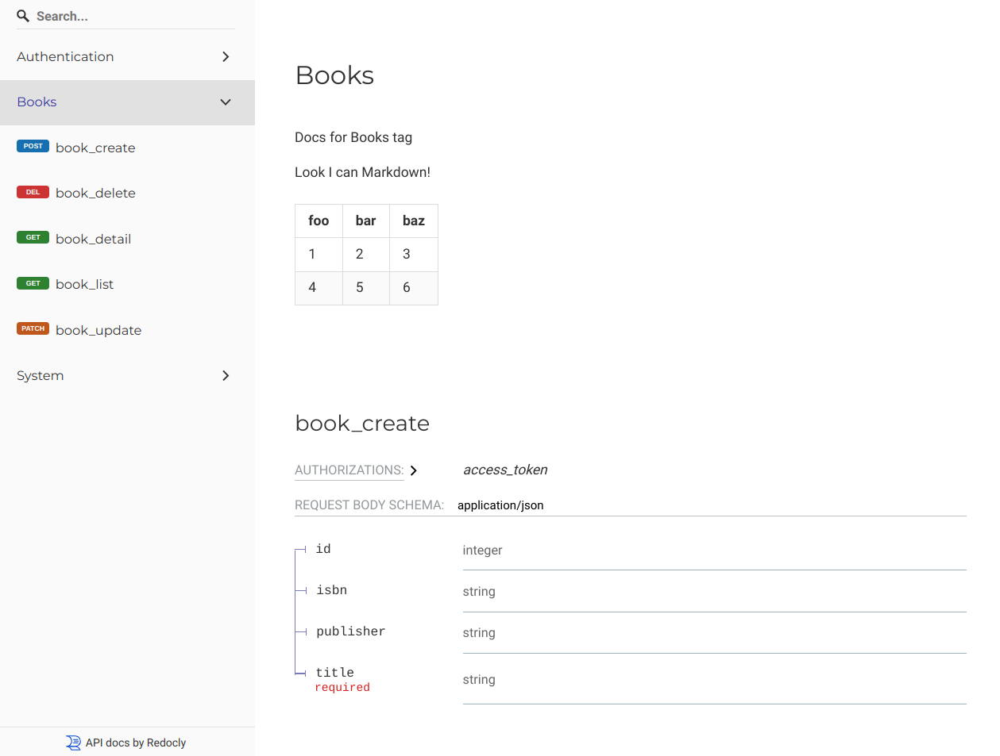
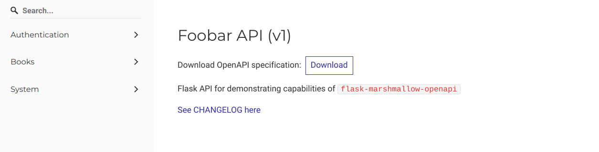

# OpenAPI middleware

This glues everything together between `flask-marshmallow-openapi` and your Flask
application.

In it's simplest form it defines API title, app's package name (for
`marshmallow.Schemas` lookup) and few other high level docs parameters.


```py
from flask_marshmallow_openapi import OpenAPISettings, OpenAPI


conf = OpenAPISettings(
    api_version="v1",
    api_name="Foobar API",
    app_package_name="foobar_api",
    mounted_at="/v1"
)

docs = OpenAPI(config=conf)
docs.init_app(app)
```

Once `init_app` is called, middleware will register routes for `swagger.json`,
`swagger.yaml`, `ReDoc` and `SwaggerUI`:

```sh
$ flask routes

Endpoint               Methods  Rule
---------------------  -------  -------------------------------
# ...
open_api.re_doc        GET      /v1/docs/re_doc
open_api.static        GET      /v1/docs/static/<path:filename>
open_api.swagger_json  GET      /v1/docs/static/swagger.json
open_api.swagger_ui    GET      /v1/docs/swagger_ui
open_api.swagger_yaml  GET      /v1/docs/static/swagger.yaml
static                 GET      /static/<path:filename>
# ...
```

Besides that, there are few more optional features that it provides which are described
below.

## Custom OpenAPI template

It is possible to inject custom Jinja2 template for `swagger.json`. The most useful
case for this is documenting tags used to group app's routes and injecting `servers`
component:

For example, we can use `my_openapi_template.yaml`:

```yaml
# my_openapi_template.yaml
title: "{{ api_name }}"
openapi_version: 3.0.2

servers:
  - url: http://127.0.0.1:5000
    description: |
      Flask dev server running locally on developer machine

  - url: https://foo.example.com
    description: Live API server

tags:
  - name: Books
    description: |
      Docs for Books tag

      Look I can Markdown!

      | foo | bar | baz |
      | --- | --- | --- |
      | 1   | 2   | 3   |
      | 4   | 5   | 6   |
```

We then distribute this template like any other Flask template but provide loader to
callback to OpenAPI middleware:

```py
import importlib.resources


def load_swagger_json_template(api_name: str, api_version: str):
    text = flask.render_template_string(
        importlib.resources.files(app_resources_package)
        .joinpath("my_openapi_template.yaml")
        .read_text(),
        api_name=api_name,
    )

    data = yaml.full_load(text)
    data["version"] = api_version
    return data


conf = OpenAPISettings(
    api_version="v1",
    api_name="Foobar API",
    app_package_name="foobar_api",
    mounted_at="/v1",
    swagger_json_template_loader=load_swagger_json_template,
    swagger_json_template_loader_kwargs={"api_name": "Foobar API", "api_version": "v1"},
)
docs = OpenAPI(config=conf)
docs.init_app(app)
```



## Changelog loader

Similarly to custom `swagger.json` template, it is possible to provide callback for loading
`CHANGELOG.md` (or similar) file:

```py
import importlib.resources

def load_changelog_md():
    return (
        importlib.resources.files(app_resources_package)
        .joinpath("CHANGELOG.md")
        .read_text()
    )

conf = OpenAPISettings(
    api_version="v1",
    api_name="Foobar API",
    app_package_name="foobar_api",
    mounted_at="/v1",
    changelog_md_loader=load_changelog_md
)
docs = OpenAPI(config=conf)
docs.init_app(app)
```

Doing so, will cause few more routes to be attached to Flask app:

```sh
$ flask routes
Endpoint                       Methods  Rule
-----------------------------  -------  -------------------------------
# ...
open_api.changelog             GET      /v1/docs/changelog
open_api.changelog_md          GET      /v1/docs/static/changelog.md
open_api...
# ...
```

`/v1/docs/changelog` renders given contents of `CHANGELOG.md`.


This can be linked from `swagger.json` and thus allow documentation consumers to have
easy access to API changelog:


```yaml
# my_openapi_template.yaml
title: "{{ api_name }}"
openapi_version: 3.0.2

info:
  description: |
    Flask API for demonstrating capabilities of `flask-marshmallow-openapi`

    [See CHANGELOG here](/v1/docs/changelog)
# ...
```

```py
conf = OpenAPISettings(
    api_version="v1",
    api_name="Foobar API",
    app_package_name="foobar_api",
    mounted_at="/v1",
    swagger_json_template_loader=load_swagger_json_template,
    swagger_json_template_loader_kwargs={"api_name": "Foobar API", "api_version": "v1"},
    changelog_md_loader=load_changelog_md
)
docs = OpenAPI(config=conf)
docs.init_app(app)
```

And result:


