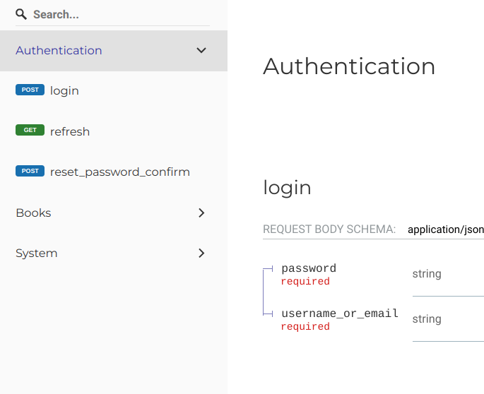
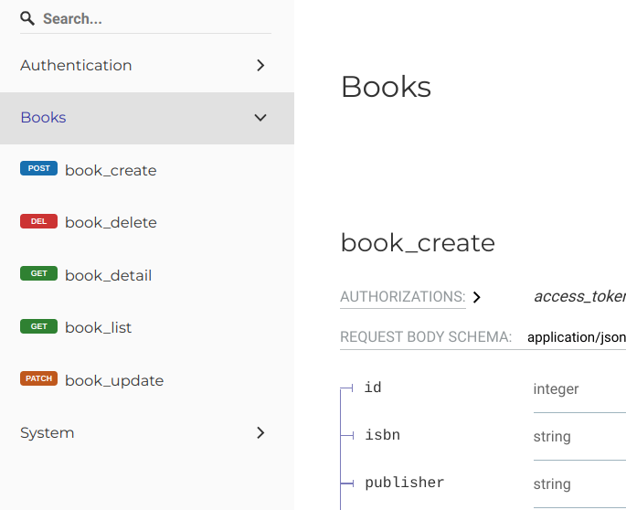
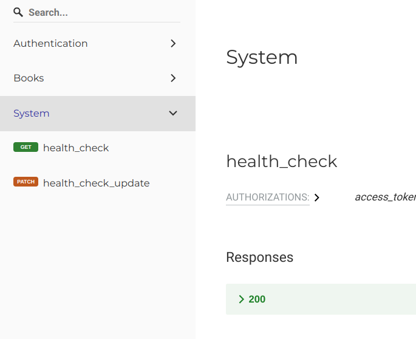

# Grouping routes' documentation: tags

We can assign one or more tags to our schemas. OpenAPI decorators will apply these tags
to any route where given schema is used as request body.

First, we need custom `marshmallow.SchemaOpts` class:

```py
class SchemaOpts(ma.SchemaOpts):
    def __init__(self, meta, *args, **kwargs):
        self.tags: list[str] | None = getattr(meta, "tags", [])
        super().__init__(meta, *args, **kwargs)
```

Then we need to use this in our schemas:

```py
class BookSchema(ma.Schema):
    OPTIONS_CLASS = SchemaOpts

    class Meta:
        tags = ["Books"]
    # ...


class BookCreateSchema(ma.Schema):
    OPTIONS_CLASS = SchemaOpts

    class Meta:
        tags = ["Books"]
    # ...


class ApiHealthCheckSchema(ma.Schema):
    OPTIONS_CLASS = SchemaOpts

    class Meta:
        tags = ["System"]
    # ...


class ApiHealthCheckUpdateSchema(ma.Schema):
    OPTIONS_CLASS = SchemaOpts

    class Meta:
        tags = ["System"]
    # ...


class ApiHealthCheckUpdateSchema(ma.Schema):
    OPTIONS_CLASS = SchemaOpts

    class Meta:
        tags = ["System"]
    # ...


class LoginRequestSchema(ma.Schema):
    OPTIONS_CLASS = SchemaOpts

    class Meta:
        tags = ["Authentication"]
    # ...


class LoginResponseSchema(ma.Schema):
    OPTIONS_CLASS = SchemaOpts

    class Meta:
        tags = ["Authentication"]
    # ...


class RefreshTokenResponseSchema(ma.Schema):
    OPTIONS_CLASS = SchemaOpts

    class Meta:
        tags = ["Authentication"]
    # ...


class NewPasswordSchema(ma.Schema):
    OPTIONS_CLASS = SchemaOpts

    class Meta:
        tags = ["Authentication"]
    # ...
```

and we get




