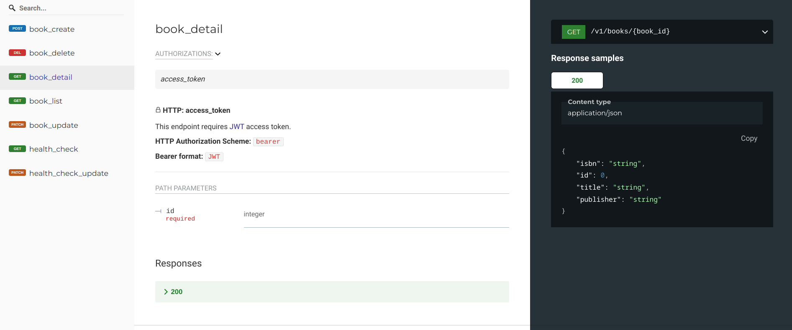
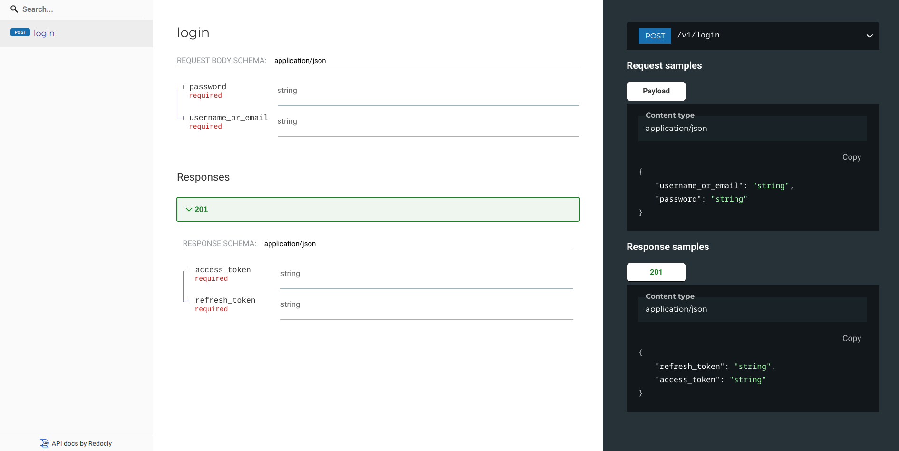
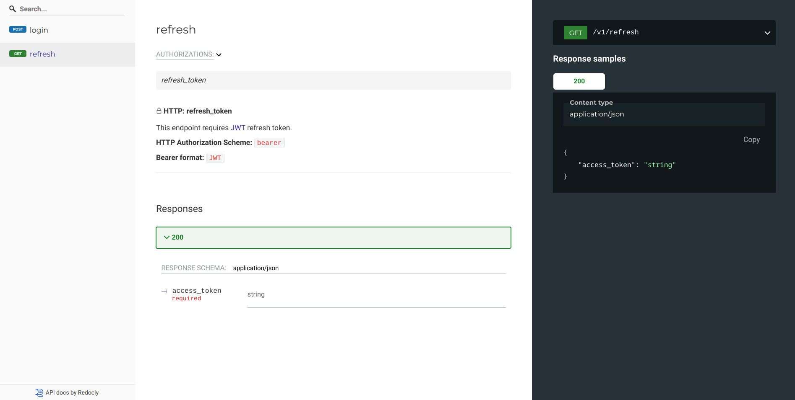

# Documenting API authentication schemes

`flask-marshmallow-openapi` assumes API is authenticated via two [JWT](https://jwt.io/)
tokens: `access_token` and `refresh_token`.

If documentation decorators are used with default value, it is assumed route requires
`access_token` and this is visible in docs.



## Routes that don't require authentication

For example, `/login` doesn't require any authentication. We use
`security=Securities.no_token` argument for this:

```py
# Using Flask app from "Getting started", this is fully working example
from flask_marshmallow_openapi import Securities

class LoginRequestSchema(ma.Schema):
    username_or_email = ma.fields.String(allow_none=False, required=True)
    password = ma.fields.String(allow_none=False, required=True)


class LoginResponseSchema(ma.Schema):
    access_token = ma.fields.String(allow_none=False, required=True)
    refresh_token = ma.fields.String(allow_none=False, required=True)


@api.route("/login", methods=["POST"])
@open_api.post(
    LoginRequestSchema,
    LoginResponseSchema,
    operation_id="login",
    security=Securities.no_token,
)
def login():
    data = LoginRequestSchema(many=False).load(flask.request.json)
    # access_token, refresh_token = validate_login(data)
    return flask.jsonify(
        LoginResponseSchema(many=False).dump(
            {"access_token": "foo", "refresh_token": "bar"}
        )
    )
```

Which gives us:



Notice how there is no "Authorizations" section present in docs for `/login`.

## Routes requiring refresh_token

Use `security=Securities.refresh_token` for this:

```py
# Using Flask app from "Getting started", this is fully working example
class RefreshTokenResponseSchema(ma.Schema):
    access_token = ma.fields.String(allow_none=False, required=True)


@api.route("/refresh", methods=["GET"])
@open_api.get(
    RefreshTokenResponseSchema,
    operation_id="refresh",
    is_list=False,
    has_id_in_path=False,
    security=Securities.refresh_token,
)
def refresh():
    # access_token = generate_access_token_from_refresh_token(flask.request)
    return flask.jsonify(
        RefreshTokenResponseSchema(many=False).dump({"access_token": "foo"})
    )
```

and we get


