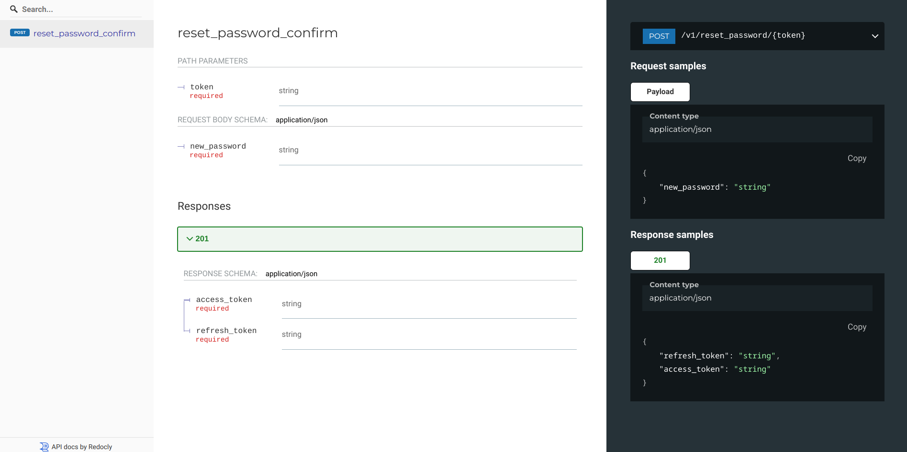
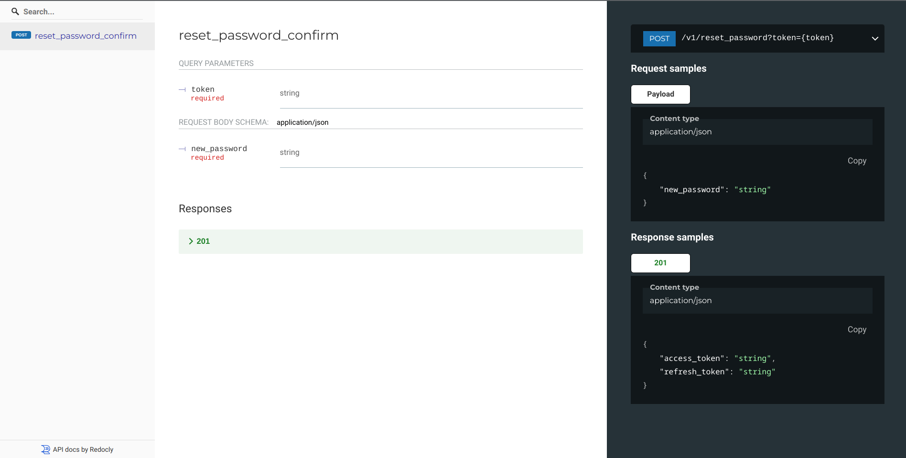

# Documenting URL parameters

We can specify url parameters as part of request schema. To do that, we need to use
`marshmallow.SchemaOptions` like this:

```py
# Using Flask app from "Getting started", this is fully working example
from openapi_pydantic_models import ParameterObject


class SchemaOpts(ma.SchemaOpts):
    def __init__(self, meta, *args, **kwargs):
        self.url_parameters: list[ParameterObject | dict] | None = getattr(
            meta, "url_parameters", None
        )
        super().__init__(meta, *args, **kwargs)
```

## Path parameters

```py
# Using Flask app from "Getting started", this is fully working example
class NewPasswordSchema(ma.Schema):
    OPTIONS_CLASS = SchemaOpts

    class Meta:
        url_parameters = [
            {
                "name": "token",
                "in": "path",
                "required": True,
                "allowEmptyValue": False,
                "schema": {"type": "string"},
            }
        ]

    new_password = ma.fields.String(allow_none=False, required=True)


@api.route("/reset_password/<token>", methods=["POST"])
@open_api.post(
    request_schema=NewPasswordSchema,
    response_schema=LoginResponseSchema,
    operation_id="reset_password_confirm",
    security=Securities.no_token,
)
def reset_password_confirm(token):
    data = NewPasswordSchema(many=False).load(flask.request.json)
    # access_token, refresh_token = validate_reset_password(token)
    return flask.jsonify(
        LoginResponseSchema(many=False).dump(
            {"access_token": "foo", "refresh_token": "bar"}
        )
    )
```

which gets us:



## Query parameters

```py
# Using Flask app from "Getting started", this is fully working example
class NewPasswordSchema(ma.Schema):
    OPTIONS_CLASS = SchemaOpts

    class Meta:
        url_parameters = [
            {
                "name": "token",
                "in": "query",
                "required": True,
                "allowEmptyValue": False,
                "schema": {"type": "string"},
            }
        ]

    new_password = ma.fields.String(allow_none=False, required=True)


@api.route("/reset_password?token=<token>", methods=["POST"])
@open_api.post(
    request_schema=NewPasswordSchema,
    response_schema=LoginResponseSchema,
    operation_id="reset_password_confirm",
    security=Securities.no_token,
)
def reset_password_confirm(token):
    data = NewPasswordSchema(many=False).load(flask.request.json)
    # access_token, refresh_token = validate_reset_password(token)
    return flask.jsonify(
        LoginResponseSchema(many=False).dump(
            {"access_token": "foo", "refresh_token": "bar"}
        )
    )
```

which gets us:


